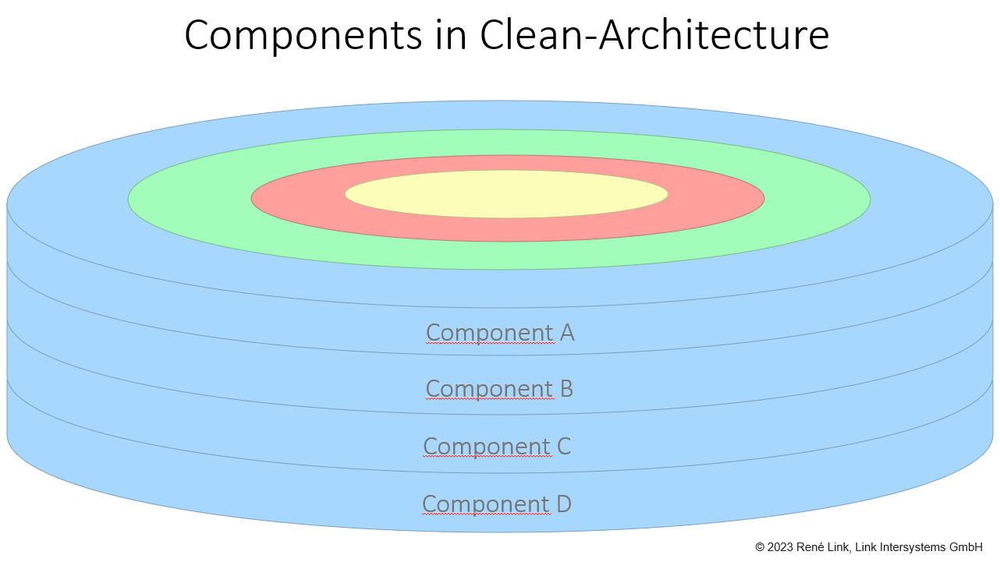
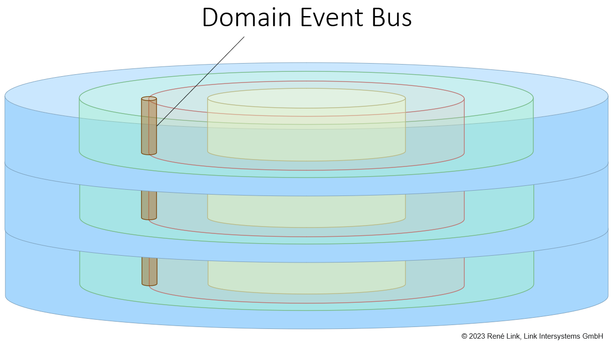
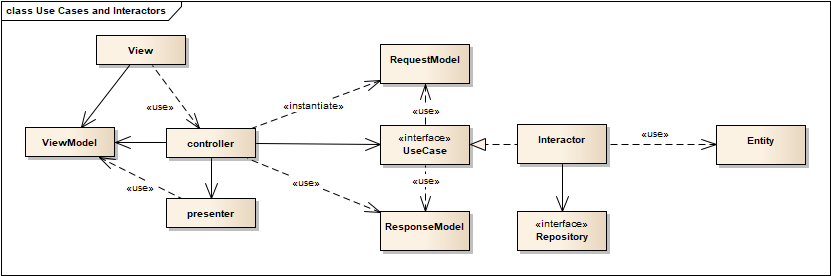

# Clean Architecture in Pure Java

This repository contains an example implementation of the clean architecture in [pure Java](#as-pure-as-possible).
You can either use this example as a starting point for discussions about the clean architecture and its various
implementation details, or you can use it to learn more about the clean architecture.

[The Clean Architecture, Robert C. Martin, 13 August 2012](https://blog.cleancoder.com/uncle-bob/2012/08/13/the-clean-architecture.html)

## Table Of Contents

- [Screaming Architecture](#screaming-architecture)
- [Package By Component](#package-by-component)
- [Modules And Components](#modules-and-components)
  - [Components In CleanArchitecture](#components-in-clean-architecture)
- [Domain Events And The Event Bus](#domain-events-and-the-event-bus)
- [As Pure As Possible](#as-pure-as-possible)
- [Implementation Notes](#implementation-notes)
  - [Use Cases And Interactors](#use-cases-and-interactors)
  - [This Example Architecture](#this-example-architecture)
- [More Sources](#more-sources)
- [The Example Domain](#the-example-domain)
  - [Domain Modules](#domain-modules)
  - [Domain Events](#domain-events)
  - [Details](#details)
    - [User Interface](#user-interface)
    - [Database](#database)
- [Any Questions?](#any-questions)

## Screaming Architecture

Uncle Bob told us that good architecture is focused on the use cases and not on details like frameworks, tools and so on.
Following the "screaming architecture" rule I tried to focus on domain aspects. Therefore, you will
find domain-related terms at the top level of this project.

## Package By Component

All [modules](#modules-and-components) in this project are structured using the *package by component* strategy as described by Simon Brown in the Clean
Architecture book - chapter 34, the missing chapter.

The package by component strategy makes use of Java's default access modifier that only allows access from
classes within the same package. It would also be possible to use the Java module system or OSGI, but I wanted
to use the simplest solution that works.

If you would like to learn more about the other packaging strategies take a look at chapter 34, the missing chapter, in
the [Clean Architecture book](https://www.amazon.com/Clean-Architecture-Craftsmans-Software-Structure/dp/0134494164).

## Modules And Components

Event though the terms module and component are widely used, there is often a lot of confusion about the meaning of them.
If you ask 5 developers: "What are the differences?", you might get 5 different answers, so here is mine:

> A component is a group of elements. A component can contain other components.

Component is derived from the latin word *componere*, which means "to put together".

> A module is a replaceable component.

The term module is derived from the latin word *modulus*, which means "measure". 
Today the meaning in general is "interchangeable part".

The example application is organized in 2 [domain modules](#domain-modules) that you find at the top level
of this project, like a [screaming architecture](#screaming-architecture) should be organized.

### Components In Clean Architecture

A component in the clean architecture spans all layers, so it's hard to explain what a component is if you only use 
a 2D diagram. So I tried to visualize my thoughts in 3D.

## Domain Events And The Event Bus

Components in the clean architecture should be completely separated, but sometimes they share common entities. The
communication between components can be done using domain events. A domain event is usually the outcome of the execution
of a use case and is published somehow. 

I would call the publishing mechanism a domain-event bus. The domain-event bus is a component that is responsible for
the delivery of domain events. Domain events are published by use cases and can are consumed by controllers or other
components within the interface adapters layer, e.g. a gateway that sends the event to an external system, like a message queue.

## As Pure As Possible

This example does not use a lot of frameworks and libraries. Especially not for the application bootstrap, 
the use cases or entities and the object-relational mapping. Thus, you will not find any Spring or Hibernate and
even no apache commons library.

Although I like frameworks and libraries as much as you probably do, I want to show how a complete application works
that is implemented in pure Java. You will probably be surprised that many frameworks and libraries can be omitted 
without significantly increasing the implementation effort. We should consider this before using a framework or library,
especially if we made the experience that framework updates sometimes make a lot of effort. Also license issues do not 
arise if we do not use them and a fix is easy to make. I don't want to say that frameworks and libraries are bad, 
but they come at a cost that we often forget. So if we use them we should know why we use them, and we should separate 
them from the core of our application to protect it. Most libraries I use in this example application are written by myself.

## Implementation Notes

When you browse the source code you should keep in mind that you see one solution for every particular technical problem
that arises when implementing the clean architecture. For a lot of situations there are more than one way to solve them.
Anyway, all solutions must honor the dependency rules of the architecture. Feel free to play with the architecture and
refactor any aspect you would like to change to see what is easy to change and what is not.

### Use Cases And Interactors

In the context of the clean architecture you will often see a diagram that uses the terms:

- use case interactor
- input and output boundary
- request/response models.

These terms are a mix between the boundary-controller-entity (BCE) by Ivar Jacobson, the hexagonal architecture
by Alistair Cockburn and the clean architecture by Robert C. Martin.

In the BCE architecture you have a boundary, a controller and an entity, as the name implies. In the hexagonal architecture
you talk about input and output ports and the clean architecture uses the terms interactors, request and response models,
and entities.

#### This Example Architecture

In this example I use the term use case for the API instead of input boundary and interactor for the use case implementation.
Request and Response models are the input and output models of the use case.

In the UI presenters are used by a controller to present response models to the user and to transform user input to
request models. The controller is invoked by the UI as a result of an event. It then uses the presenter to create a request
model and invokes the use case.

In this point my architecture is different to the diagram I showed above, because it does not decouple a presenter from a
controller, and thus it doesn't need to pass an output boundary to a use case interactor. Therefore, my architecture
has a lot less complexity in this area, but at the cost that controllers are not separated from presenters. It's true
that I don't have the benefits of decoupling them, but I also don't have a lot of implementation issues that arise from
the decoupling. It's a tradeoff that I made in the UI/use case integration to reduce the complexity in that area. I made
that decision, because the focus of the example application is the use case part, how these classes are structured and
how different modules integrate.

Since this example should be used as a starting point for discussions, feel free to refactor the UI/use case integration part
and [start a discussion](https://github.com/link-intersystems/clean-architecture-example/discussions).

## More Sources

If you would like to learn more about clean code and the clean architecture,
you should take a look at my [youtube channel - clean-code.guru (german)](https://www.youtube.com/@cleancodeguru).

I also would like to recommend the [cleancoders.com](https://cleancoders.com) website, where you can find a lot of
videos about clean code. Most of them provided by Robert "Uncle Bob" Martin and Micah Martin.

## The Example Domain

For this clean architecture example I chose a car rental application which is complex enough to address common implementation issues, but simple enough 
to stay focused on the architecture and not the domain.

### Domain Modules

The application is separated in 2 domain module in order to show how communication via [domain](#domain-events) events can be done.
Each module implements several use cases that are the modules components.

- car-booking
   
  The car-booking module contains the use cases a customer executes, like find car offers and book a car.  
- car-management

  The car-management module contains the use cases a salesperson executes, like handover a car to a customer and return one. 

You might want to explore the clean architecture further by implementing more use cases.

Here is a list of user story proposals:

1. As a sales manager I would like to define multiple rental rates with
   a different, but never overlapping, validity period, so that rates can vary over time.
2. As a sales manager I would like to specify different stations where the customer can pick up cars.
3. As a customer I would like to get offers for stations in the city where I live (my address).

## Domain Events

The domain modules are completely separated, which means that each one uses its own dedicated data storage. At the moment they
are separated by two different database schemas, but they could also use their own database. The management module reacts
to domain events that are fired by the car-booking module in order to update its database. I chose that way to 
demonstrate how domain events can be implemented.

In the current implementation the domain events are synchronously published on the same thread. Since I use local
transactions that are bound to the thread, the event subscribers logic is executed in the same transaction as the 
publisher.

Feel free to refactor the domain event bus to use asynchronous event publishing or even an external event queue.

## Details

### User Interface

The example application comes with a very basic swing ui that you can use to try out the application. Since it
is a basic ui it neither has any convenience features, like validation, nor it is very nice. The purpose of the
user interface is to provide a simple GUI to access the use cases. It also shows the basics of how use cases are
connected to controllers and how controllers use presenters in order to update models. Feel free to implement a 
web server and provide rest controllers in order to support a web ui.

### Database

The application uses a H2 file database that is automatically created in the working directory when you start the 
application. This will contain some test data. If you need to reset the database, just delete the carrental.mv.db in the 
working directory.

The example data is the same as the data that the unit tests use. So you can also browse it here:

- [car booking test data](car-booking/entities/src/site/markdown/TestFixtures.md)

## Any Questions?

If you have any questions about

- this example application you can [start a discussion](https://github.com/link-intersystems/clean-architecture-example/discussions).
- the clean architecture and clean code in general you can browse [my answers on stackoverflow](https://stackoverflow.com/search?q=user%3A974186+%5Bclean-architecture%5D) or post 
  a new answer. I usually watch new answers to the [clean-architecture](https://stackoverflow.com/questions/tagged/clean-architecture) and
  [hexagonal-architecture](https://stackoverflow.com/questions/tagged/hexagonal-architecture) tag.
- clean code in general or software architecture, you can either take a look at my [youtube channel - clean-code.guru (german)](https://www.youtube.com/@cleancodeguru) or
  [contact me](https://link-intersystems.com/contact-us/) for trainings and coaching or book a session on .

