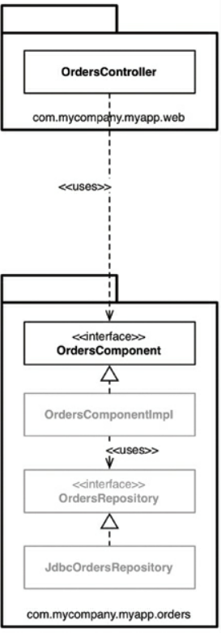

# Clean Architecture 

This repository contains an example implementation of the clean architecture. It should be a starting point for
discussions about the clean architecture and its various implementation details.

[The Clean Architecture, Robert C. Martin, 13 August 2012](https://blog.cleancoder.com/uncle-bob/2012/08/13/the-clean-architecture.html)

## Screaming Architecture

Uncle Bob told us that good architecture is focused on the use cases and not on details like frameworks, tools and so on.
Following the "screaming architecture" rule I tried to focus on domain aspects. Therefore, you will
find domain-related terms at the top level of this project.

## Package By Component

All [domain modules](#domain-modules) in this project are structured using the *package by component* strategy as described by Simon Brown in the Clean
Architecture book - chapter 34, the missing chapter.

The package by component strategy makes use of Java's default access modifier that only allows access from
classes within the same package. It would also be possible to use the Java module system or OSGI, but I wanted
to use the simplest solution that works.

## The Example Domain

For this clean architecture example I chose a car rental application which is complex enough to address common implementation issues, but simple enough 
to stay focused on the architecture and not the domain.

### Domain Modules

The application is made of 2 domain modules. Follow the links of the modules for details about each one.

- [car-booking](car-booking/README.md)
   
  The car-booking module contains the use cases a customer executes, like find car offers and book a car.  
- [car-management](car-management/README.md)

  The car-management module contains the use cases a salesperson executes, like handover a car to a customer and return one. 

You might want to explore the clean architecture further by implementing more use cases.

Here is a list of user story proposals:

1. As a sales manager I would like to define multiple rental rates with
   a different, but never overlapping, validity period, so that rates can vary over time.
2. As a sales manager I would like to specify different stations where the customer can pick up cars.
3. As a customer I would like to get offers for stations in the city where I live (my address).

## Details

### User Interface

The example application comes with a very basic swing ui that you can use to try out the application. Since it
is a basic ui it neither have any convenience features, like validation, nor it is very nice. The purpose of the
user interface is to provide a simple GUI to access the use cases. It also shows the basics of how use cases are
connected to controllers and how controllers use presenters in order to update models. Feel to implement a web server
and provide rest controllers in order to support a web ui.

### Database

The application uses a H2 file database that is automatically created in the working directory when you start the 
application. This will contain some test data. If you need to reset the database, just delete the carrental.mv.db in the 
working directory.

The example data is the same as the data that the unit tests use. So you can also browse it here:

- [car booking test data](car-booking/entities/src/site/markdown/TestFixtures.md)

## Notes about the source code

When you browse the source code you should keep in mind that you see one solution for every particular technical problem
that arises when implementing the clean architecture. For a lot of situations there are more than one way to solve them. 
Anyway, all solutions must honor the dependency rules of the architecture. Feel free to play with the architecture and
refactor any aspect you would like to change to see what is easy to change and what is not.

## More Sources About Clean Code And Clean Architecture

If you would like to learn more about clean code and the clean architecture, 
you should take a look at my [youtube channel - clean-code.guru (german)](https://www.youtube.com/@cleancodeguru).

I also would like to recommend the [cleancoders.com](https://cleancoders.com) website, where you can find a lot of 
videos about clean code. Most of them provided by Robert "Uncle Bob" Martin and Micah Martin.

